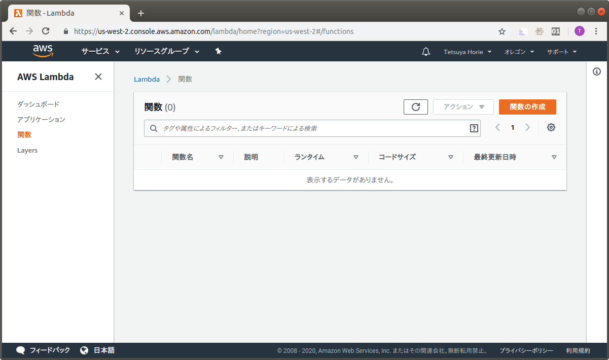
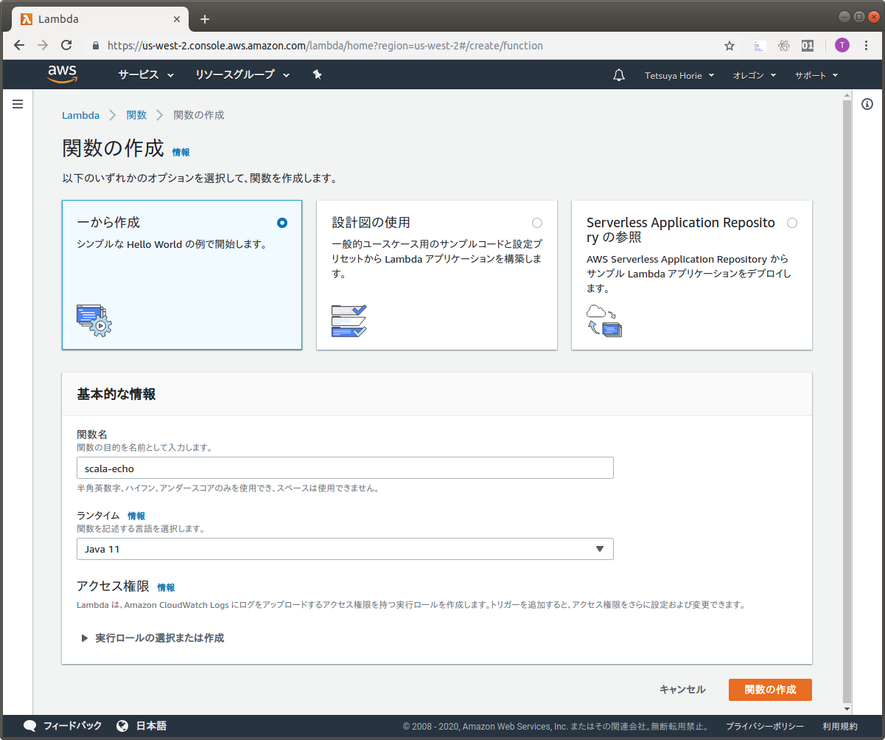
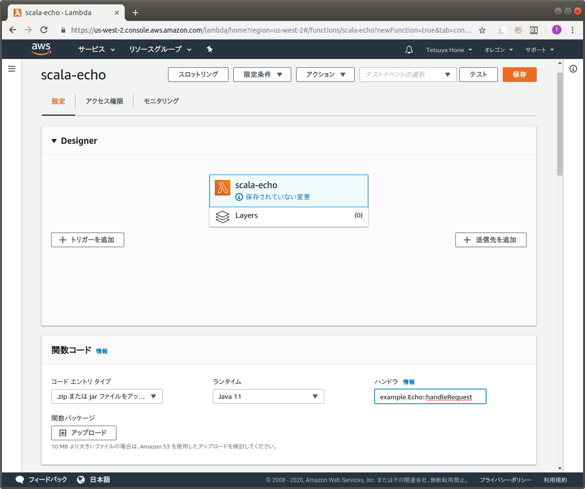
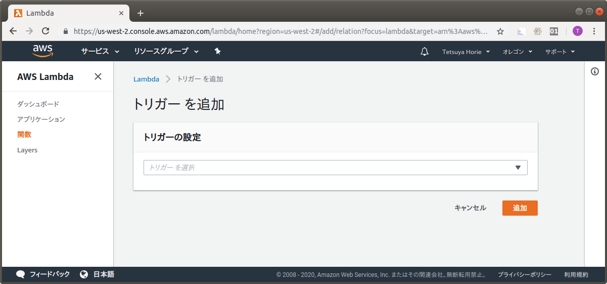
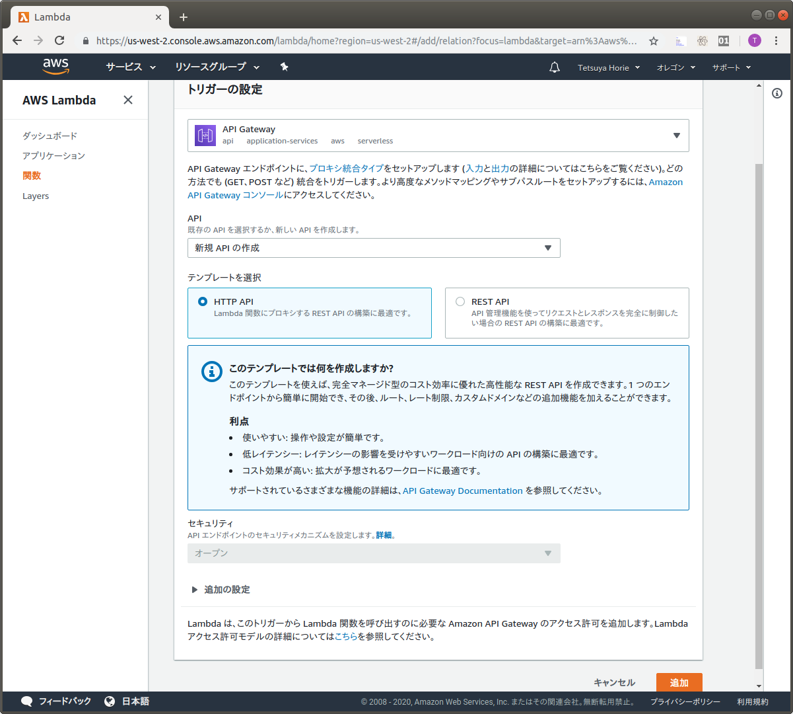
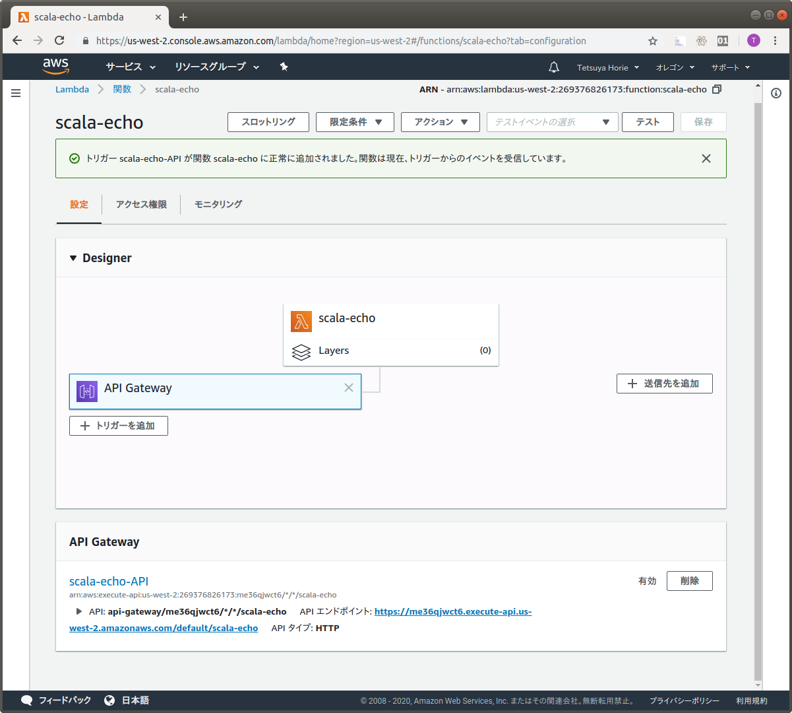

# ScalaでAWS Lambda

Scalaで書いた、AWS Lambdaを、API GatewayのHTTP APIで呼び出すサンプルコードです。

## AWS Lambda関数の実装

RequestHandlerインタフェースを実装します。

```scala
import java.util.Base64

import com.amazonaws.services.lambda.runtime.Context
import com.amazonaws.services.lambda.runtime.RequestHandler

trait EchoBase extends RequestHandler[Request, Response]{
  override def handleRequest(request: Request, context: Context) = {
    val decodedBody = new String(Base64.getDecoder.decode(request.body))
    new Response(decodedBody)
  }
}

class Echo extends EchoBase
```

Request, Responseのクラスを実装します。

```scala
import scala.beans.BeanProperty

class Request {
  @BeanProperty
  var body: String = _
}

class Response(bodyJson: String) {
  @BeanProperty
  val statusCode = 200

  @BeanProperty
  val headers: Object = new Object

  @BeanProperty
  var body: String = bodyJson
}
```

このAWS Lambdaは、AWS API Gateway(HTTP API)から呼び出されるので、クラスの構造をAPI Gatewayの仕様に合わせる必要があります。

尚、AWS Lambdaは、AWS API GatewayとはJSONでデータをやりとします。JSONとクラスの変換は、@BeanPropertyアノテーションを付けて、名前をJSONのハッシュのキーと合わせておけば、AWS Lambda側で自動的に変換されます。
正式なJSONのフォーマットは、「[プロキシ統合のための Lambda 関数の入力形式](https://docs.aws.amazon.com/ja_jp/apigateway/latest/developerguide/set-up-lambda-proxy-integrations.html#api-gateway-simple-proxy-for-lambda-input-format)」、「[プロキシ統合のための Lambda 関数の出力形式](https://docs.aws.amazon.com/ja_jp/apigateway/latest/developerguide/set-up-lambda-proxy-integrations.html#api-gateway-simple-proxy-for-lambda-output-format)」を参照してください。

## jarファイルの作成

jarファイルを作成します。(jarファイルはtarget/scala-2.13/lambda_echo-assembly-0.1.0-SNAPSHOT.jarとして出力されます)

```bash
$ sbt assembly
```

## AWS Lambda関数の作成

AWS Lambdaのコンソール画面を表示します。



[関数の作成]ボタンをクリックします。



[関数名]に「scala-echo」と入力し、[ランタイム]は「Java 11」を選択し、[関数の作成]ボタンをクリックします。



[ハンドラ]を「example.Echo::handleRequest」に変更します。(Echoになっている事に注意)

[アップロード]バタンをクリックしてjarをアップロードして、[保存]ボタンをクリックします。

[トリガーを追加]ボタンをクリックします。



[トリガーを選択]で「API Gateway」を選択します。



[テンプレート]は「HTTP API」のままにして、[追加]ボタンをクリックします。



画面下部のAPIエンドポイントにPOST Requestを行います。

```bash
$ curl -X POST -d 'Hello, world!' https://me36qjwct6.execute-api.us-west-2.amazonaws.com/default/scala-echo
Hello, world!
```

注意: 上記URLは既に削除していますので、アクセスできません。
