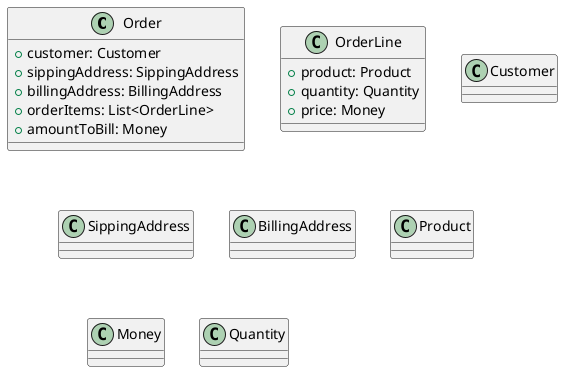
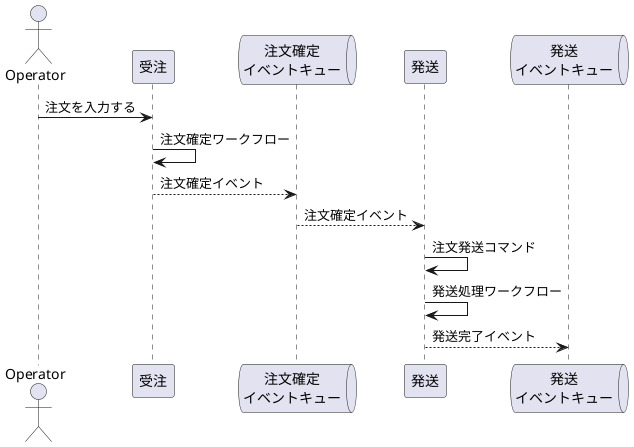
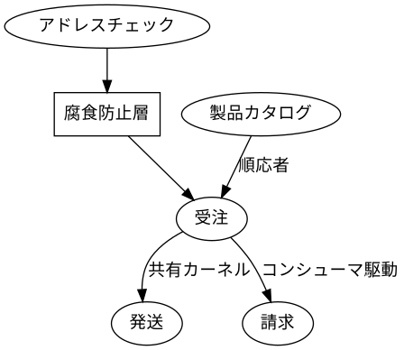
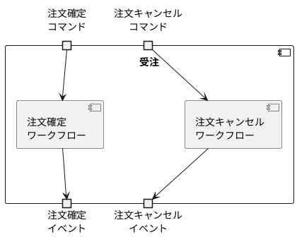
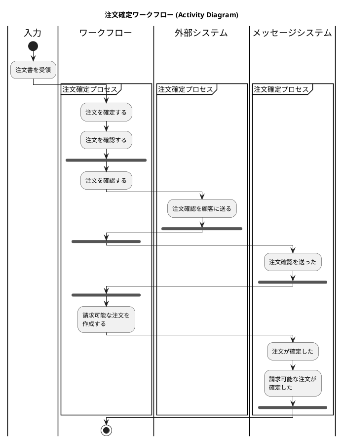

# 関数型ドメイン駆動モデリングの読書メモ

# 1章 ドメイン駆動設計の紹介

### 1.2.2 ドメインを探索する: 受注システム


# 2章 ドメインのモデリング

### 2.1.3 インプットとアウトプットを考える


## 2.4 ドメインの文書化

下記のイベントストーミングの結果がある。

```yaml
context: 
  name: 受注
workflows:
  - name: 注文を確定する
    input: 
      - name: 注文書
      - name: 製品カタログ
    command: 注文を確定する
    domain events: 
      - name: 注文を確定した
        policy: 
          - description: 注文確定時には注文確認書を送る
            command: 注文確認書を送る

  - name: 注文確認書を送る
    input: 
      - name: 注文書
    command: 注文確認書を送る
```



## 2.6 複雑さをドメインモデルで表現する

### 2.6.1 制約条件の表現

```plantuml
interface ProductCode <<sealed>> {
  + code(): String
}
note right of ProductCode: permits WidgetCode, GizmoCode

class WidgetCode <<record>> <<final>> {
  + code: String
}
note right of WidgetCode::code 
  Wで始まる4桁の数字
end note

class GizmoCode <<record>> <<final>> {
  + code: String
 }
 note right of GizmoCode::code 
   Gで始まる3桁の数字
end note
 
ProductCode <|-- WidgetCode
ProductCode <|-- GizmoCode
```

```plantuml
interface OrderQuantity <<sealed>> {
  + quantity(): Number
}
note right of OrderQuantity: permits UnitQuantity, KilogramQuantity

class UnitQuantity <<record>> <<final>> {
  + quantity: Integer
}
note right of UnitQuantity::quantity
  1 から 1000 まで
end note

class KilogramQuantity <<record>> <<final>> {
  + quantity: BigDecimal
}
note right of KilogramQuantity::quantity
  0.05 から 100.00 まで
end note

OrderQuantity <|-- UnitQuantity
OrderQuantity <|-- KilogramQuantity
```

### 2.6.2 注文のライフサイクルを表現する

```plantuml
class UnvalidatedOrder <<record>>  <<final>> {
  + customer: UnvalidatedCustomer
  + sippingAddress: UnvalidatedSippingAddress
  + billingAddress: UnvalidatedBillingAddress
  + orderItems: List<UnvalidatedOrderLine>
}

class UnvalidatedOrderLine {
  + productCode: ProductCode
  + quantity: OrderQuantity
}

class ValidatedOrder <<record>> <<final>> {
  + customer: ValidatedCustomer
  + sippingAddress: ValidatedSippingAddress
  + billingAddress: ValidatedBillingAddress
  + orderItems: List<ValidatedOrderLine>
}

class ValidatedOrderLine {
  + productCode: ProductCode
  + quantity: OrderQuantity
}

class PricedOrder <<record>> <<final>> {
  + customer: ValidatedCustomer
  + sippingAddress: ValidatedSippingAddress
  + billingAddress: ValidatedBillingAddress
  + orderItems: List<PricedOrderLine>
  + amountToBill: Money
}

class PricedOrderLine <<record>> <<final>> {
  + orderLine: ValidatedOrderLine
  + linePrice: Money
}

class PlacedOrderAcknowledgement {
  + pricedOrder: PricedOrder
  + acknowledgementLetter: AcknowledgementLetter
}
```

### 2.6.3 ワークフローのステップを具体化する

```yaml
workflows:
  - name: 注文を確定する
    input: 
      - name: 注文書
    output:
      oneOf: 
        - domainEvent: 
          - name: 注文を確定した
        - InvalidOrder:
    substeps:
      - ValidateOrder
      - PriceOrder
      - SendAcknowledgementToCustomer
      - SendPlacedOrderAcknowledgement
    return:
      - OrderPlacedEvent
```

```yaml
substeps:
  - name: ValidateOrder
    input: 
      - UnvalidatedOrder
    output:
      oneOf: 
        - ValidatedOrder
        - ValidationError
    dependencies:
      - CheckProductCodeExists
      - CheckAddressExists
    do:
      - "validate the customer name"
      - "check that the sipping and billing addresses exist"
      - for each line:
        - "check product code syntax"
        - "check that product code exists in ProductCatalog"
      - if everything is ok:
        - "return ValidatedOrder"
      - if there is an error:
        - "return ValidationError"

  - name: PriceOrder
    input: 
      - ValidatedOrder
    output:
      - PricedOrder
    dependencies:
        - GetProductPrice
    do:
      - for each line:
        - "get the price of the product"
        - "set the price for the line
      - "set the amount to bill (= sum of line prices)" 

  - name: SendAcknowledgementToCustomer
    input:
      - PricedOrder
    output: []
    do:
      - "create an acknowledgement letter"
      - "send the acknowledgement letter and the priced order to the customer"
```

# 3章 関数型アーキテクチャ

## 3.2 境界づけられたコンテストのコミュニケーション



## 3.3 境界づけられたコンテキスト間の契約



## 3.4 境界づけられたコンテキストでのワークフロー



### 3.4.2 境界づけられたコンテキスト内ではドメインイベントを避ける



# 4章 方の理解

## 4.3 型の合成

### 4.3.1 "AND"型

```fsharp
type FruitSalad = {
  Apple: AppleVriety
  Banana: BananaVriety
  Cherries: CherriesVriety
}
```

```java
record FruitSalad(AppleVriety apple, 
                  BananaVriety banana,
                  CherriesVriety cherries
) {}
```

### 4.3.2 "OR"型

```fsharp
type FruitSnack = 
  | Apple of AppleVriety
  | Banana of BananaVriety
  | Cherries of CherriesVriety
  
type AppleVariety =
  | GoldenDelicious
  | GrannySmith
  | Fuji

type BananaVariety =
  | Cavendish
  | GrosMichel
  | Manzano

type CherryVariety =
  | Montmorency
  | Bing
```

```java
public enum AppleVariety {
    GoldenDelicious, GrannySmith, Fuji
}

public enum BananaVariety {
    Cavendish, GrosMichel, Manzano
}

public enum CherryVariety {
    Montmorency, Bing
}

public sealed interface FruitSnack permits FruitSnack.Apple, FruitSnack.Banana, FruitSnack.Cherries {

    record Apple(AppleVariety variety) implements FruitSnack {}
    record Banana(BananaVariety variety) implements FruitSnack {}
    record Cherries(CherryVariety variety) implements FruitSnack {}
}
```

### 4.3.3 単純型

```fsharp
type ProductCode =
  | ProductCode of string
```

```java
record ProductCode(String code) {}
```

## 4.4 型を扱う

```java
record Person(String first, String last) {}

public sealed interface OrderQuantity permits OrderQuantity.UnitQuantity, OrderQuantity.KilogramQuantity {
    record UnitQuantity(int quantity) implements OrderQuantity {}
    record KilogramQuantity(BigDecimal quantity) implements OrderQuantity {}
}
```

## 4.5 型の合成によるドメインモデルの構築

```java
record CheckNumber(int checkNumber) {}
record CardNumber(String cardNumber) {}
```

```java
public sealed interface CardType permits CardType.Visa, CardType.MasterCard {
    record Visa(CardNumber cardNumber) implements CardType {}
    record MasterCard(CardNumber cardNumber) implements CardType {}
}
```

```java
import java.math.BigDecimal;

public sealed interface PaymentMethod permits PaymentMethod.Cash, PaymentMethod.CreditCardInfo, PaymentMethod.CheckNumber {
    record Cash(int amount) implements PaymentMethod {
    }

    record CreditCardInfo(CardType cardType) implements PaymentMethod {
    }

    record CheckNumber(int checkNumber) implements PaymentMethod {
    }
}

record PaymentAmount(BigDecimal paymentAmount) {}

public enum Currency {
    USD,
    EUR
}

record Payment(
        PaymentAmount amount,
        Currency currency,
        PaymentMethod method
) {}
```

```java
  @FunctionalInterface
  public interface PayInvoice {
      PaidInvoice apply(UnpaidInvoice invoice, Payment payment);
  }

  // 使用
  PayInvoice payInvoice = (invoice, payment) -> new PaidInvoice(invoice.invoiceNumber);
  PaidInvoice result = payInvoice.apply(unpaidInvoice, payment);
```

## 4.6

### 4.6.1

```java
record PersonalName(String firstName, Optional<String> middleInitial, String lastName) {}
```

### 4.6.2

```java
  Either<String, Integer> success = Either.right(42);
  Either<String, Integer> failure = Either.left("something went wrong");

 //パターンマッチング相当の操作:

  // F#: match result with | Ok v -> ... | Error e -> ...
  Either<String, Integer> result = Either.right(42);

  // ① fold — 両ケースを処理して値を返す
  String message = result.fold(
      error   -> "Error: " + error,   // Left (失敗)
      success -> "OK: " + success     // Right (成功)
  );
```

```java
  @FunctionalInterface
  public interface PayInvoice {
      Ether<PaidInvoice, PaymentError> apply(UnpaidInvoice invoice, Payment payment);
  }
```

```java
public enum PaymentError {
    CARD_TYPE_NOT_RECOGNIZED,
    PAYMENT_REJECTED,
    PAYMENT_PROVIDERS_OFFLINE
}
```

# 5章 型によるドメインモデリング

## 5.2 ドメインモデルのパターンを見る

* 単純な値
* ANDによる組み合わせ
* ORによる選択肢
* ワークフロー

#### Javaでのパターン

* 単純な値: recordで表現(ValueObject)
* ANDによる組み合わせ: recordで表現(Entity, AggregateRoot)
* ORによる選択肢: sealed interfaceで表現(ValueObject, Entity, AggregateRoot)
* ワークフロー: Functional Interfaceで表現

## 5.3 単純な値のモデリング

```java
record CustomerId(int customerId) {}
```

## 5.4 複雑なデータのモデリング

### 5.4.1 レコード型によるモデリング

Javaの場合、タイトルの通りになる。

```java
record Order(
  CustomerInfo customerInfo,
  ShippingAddress shippingAddress,
  BillingAddress billingAddress,
  List<OrderLine> orderLines,
  Money amountToBill
) {}
```

### 5.4.3 選択型によるモデリング

```java
public sealed interface OrderQuantity permits 
        OrderQuantity.UnitQuantity, OrderQuantity.KilogramQuantity {
    record UnitQuantity(int quantity) implements OrderQuantity {}
    record KilogramQuantity(BigDecimal quantity) implements OrderQuantity {}
}
```

## 5.5 関数によるワークフローのモデリング

### 5.5.1 複雑な入力と出力の処理

出力が複数ある場合はrecordで格納する

```java
record PlaceOrderEvents(
    AcknowlegementSent acknowlegementSent,
    OrderPlaced orderPlaced,
    BillableOrderPlaced billableOrderPlaced
) {}
```

ワークフローの型定義

```java
@FunctionalInterface
public interface PlaceOrder extends Function<UnvalidatedOrder, PlaceOrderEvents> {
}
```

どちらかを出力する場合

```java
public EnvelopeContents(String envelopeContents) {}
public sealed interface CategorizedMail 
        permits CategorizedMail.QuoteForm, CategorizedMail.OrderForm {
    record QuoteForm(String quoteForm) implements CategorizedMail {}
    record OrderForm(String orderForm) implements CategorizedMail {}
}

@FunctionalInterface
public interface CategorizeInboundMail extends Function<EnvelopeContents, CategorizedMail> {
}
```

複数の入力が必要な場合

```java
import java.util.PrimitiveIterator;

@FunctionalInterface
public interface CalculatePrices extends BiFunction<OrderForm, ProductCatalog, PricedOrder> {
}
```

### 5.5.2 関数シグネチャでエフェクトを文書化する

```java
@FunctionalInterface
public interface ValidateOrder extends Function<UnvalidatedOrder, Either<ValidationError, ValidatedOrder>> {
}

record ValidationError(String fieldName, String errorDescription) {}
```

非同期の場合

```java
import java.util.concurrent.CompletableFuture;

@FunctionalInterface
public interface ValidateOrderAsync
        extends Function<UnvalidatedOrder, CompletableFuture<Either<ValidationError, ValidatedOrder>>> {
}
```

## 5.6 アイデンティティの考察: 値オブジェクト

recordの`equals()`で判定する

```java
  var widgetCode1 = new WidgetCode("W12345");
  var widgetCode2 = new WidgetCode("W12345");
  
  IO.println(widgetCode1.equals(widgetCode2));
```

## 5.7 アイデンティティの考察: エンティティ


## 5.8 集約