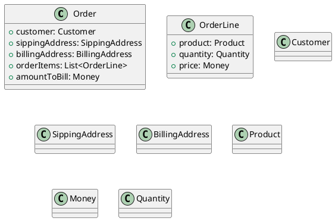
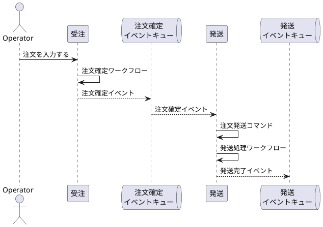
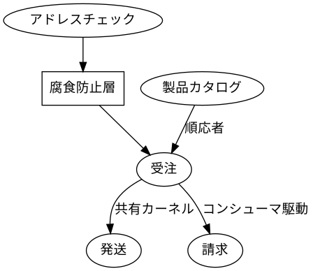
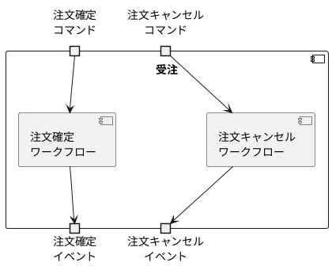
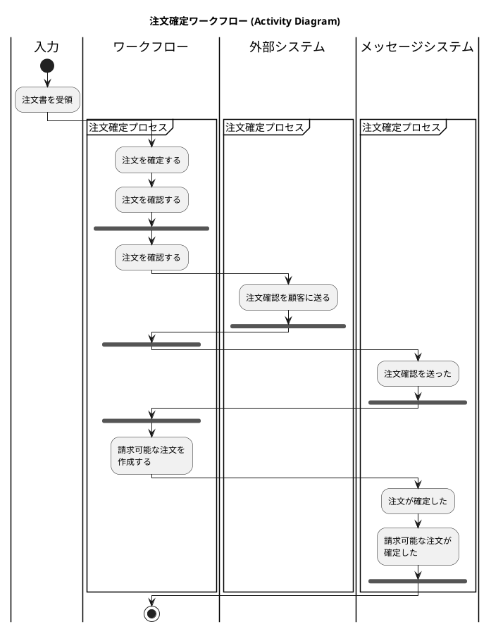

# 関数型ドメイン駆動モデリングの読書メモ

# 1章

### 1.2.2 ドメインを探索する: 受注システム


# 2章

### 2.1.3 インプットとアウトプットを考える


## 2.4 ドメインの文書化

下記のイベントストーミングの結果がある。

```yaml
context: 
  name: 受注
workflows:
  - name: 注文を確定する
    input: 
      - name: 注文書
      - name: 製品カタログ
    command: 注文を確定する
    domain events: 
      - name: 注文を確定した
        policy: 
          - description: 注文確定時には注文確認書を送る
            command: 注文確認書を送る

  - name: 注文確認書を送る
    input: 
      - name: 注文書
    command: 注文確認書を送る
```



## 2.6 複雑さをドメインモデルで表現する

### 2.6.1 制約条件の表現

```plantuml
interface ProductCode <<sealed>> {
  + code(): String
}
note right of ProductCode: permits WidgetCode, GizmoCode

class WidgetCode <<record>> <<final>> {
  + code: String
}
note right of WidgetCode::code 
  Wで始まる4桁の数字
end note

class GizmoCode <<record>> <<final>> {
  + code: String
 }
 note right of GizmoCode::code 
   Gで始まる3桁の数字
end note
 
ProductCode <|-- WidgetCode
ProductCode <|-- GizmoCode
```

```plantuml
interface OrderQuantity <<sealed>> {
  + quantity(): Number
}
note right of OrderQuantity: permits UnitQuantity, KilogramQuantity

class UnitQuantity <<record>> <<final>> {
  + quantity: Integer
}
note right of UnitQuantity::quantity
  1 から 1000 まで
end note

class KilogramQuantity <<record>> <<final>> {
  + quantity: BigDecimal
}
note right of KilogramQuantity::quantity
  0.05 から 100.00 まで
end note

OrderQuantity <|-- UnitQuantity
OrderQuantity <|-- KilogramQuantity
```

### 2.6.2 注文のライフサイクルを表現する

```plantuml
class UnvalidatedOrder <<record>>  <<final>> {
  + customer: UnvalidatedCustomer
  + sippingAddress: UnvalidatedSippingAddress
  + billingAddress: UnvalidatedBillingAddress
  + orderItems: List<UnvalidatedOrderLine>
}

class UnvalidatedOrderLine {
  + productCode: ProductCode
  + quantity: OrderQuantity
}

class ValidatedOrder <<record>> <<final>> {
  + customer: ValidatedCustomer
  + sippingAddress: ValidatedSippingAddress
  + billingAddress: ValidatedBillingAddress
  + orderItems: List<ValidatedOrderLine>
}

class ValidatedOrderLine {
  + productCode: ProductCode
  + quantity: OrderQuantity
}

class PricedOrder <<record>> <<final>> {
  + customer: ValidatedCustomer
  + sippingAddress: ValidatedSippingAddress
  + billingAddress: ValidatedBillingAddress
  + orderItems: List<PricedOrderLine>
  + amountToBill: Money
}

class PricedOrderLine <<record>> <<final>> {
  + orderLine: ValidatedOrderLine
  + linePrice: Money
}

class PlacedOrderAcknowledgement {
  + pricedOrder: PricedOrder
  + acknowledgementLetter: AcknowledgementLetter
}
```

### 2.6.3 ワークフローのステップを具体化する

```yaml
workflows:
  - name: 注文を確定する
    input: 
      - name: 注文書
    output:
      oneOf: 
        - domainEvent: 
          - name: 注文を確定した
        - InvalidOrder:
    substeps:
      - ValidateOrder
      - PriceOrder
      - SendAcknowledgementToCustomer
      - SendPlacedOrderAcknowledgement
    return:
      - OrderPlacedEvent
```

```yaml
substeps:
  - name: ValidateOrder
    input: 
      - UnvalidatedOrder
    output:
      oneOf: 
        - ValidatedOrder
        - ValidationError
    dependencies:
      - CheckProductCodeExists
      - CheckAddressExists
    do:
      - "validate the customer name"
      - "check that the sipping and billing addresses exist"
      - for each line:
        - "check product code syntax"
        - "check that product code exists in ProductCatalog"
      - if everything is ok:
        - "return ValidatedOrder"
      - if there is an error:
        - "return ValidationError"

  - name: PriceOrder
    input: 
      - ValidatedOrder
    output:
      - PricedOrder
    dependencies:
        - GetProductPrice
    do:
      - for each line:
        - "get the price of the product"
        - "set the price for the line
      - "set the amount to bill (= sum of line prices)" 

  - name: SendAcknowledgementToCustomer
    input:
      - PricedOrder
    output: []
    do:
      - "create an acknowledgement letter"
      - "send the acknowledgement letter and the priced order to the customer"
```

# 3章

## 3.2 境界づけられたコンテストのコミュニケーション



## 3.3 境界づけられたコンテキスト間の契約



## 3.4 境界づけられたコンテキストでのワークフロー



### 3.4.2 境界づけられたコンテキスト内ではドメインイベントを避ける

