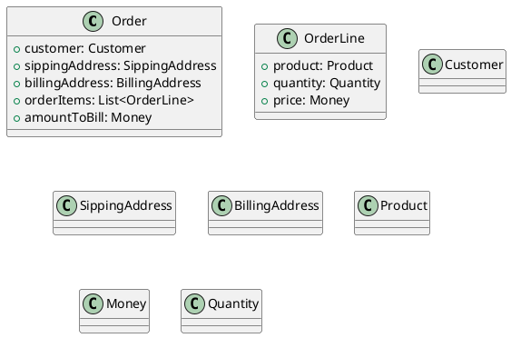

# 関数型ドメイン駆動モデリングの読書メモ

# 1章

### 1.2.2 ドメインを探索する: 受注システム


# 2章

### 2.1.3 インプットとアウトプットを考える


## 2.4 ドメインの文書化

下記のイベントストーミングの結果がある。

```yaml
context: 
  name: 受注
workflows:
  - name: 注文を確定する
    input: 
      - name: 注文書
      - name: 製品カタログ
    command: 注文を確定する
    domain events: 
      - name: 注文を確定した
        policy: 
          - description: 注文確定時には注文確認書を送る
            command: 注文確認書を送る

  - name: 注文確認書を送る
    input: 
      - name: 注文書
    command: 注文確認書を送る
```


