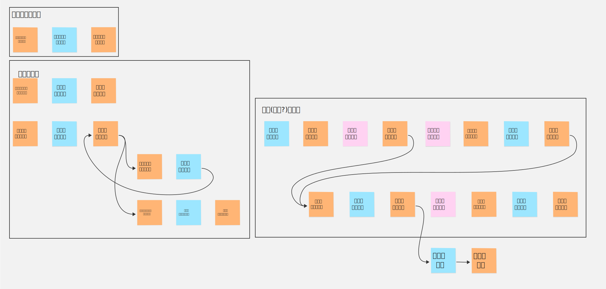
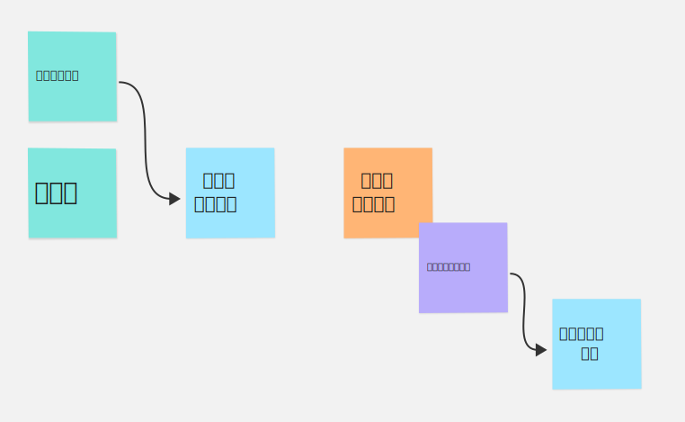
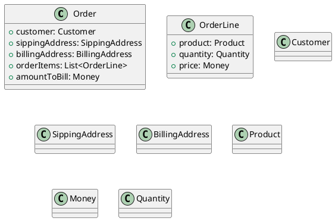
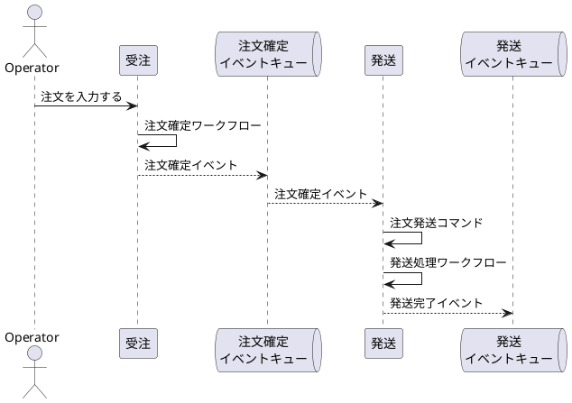
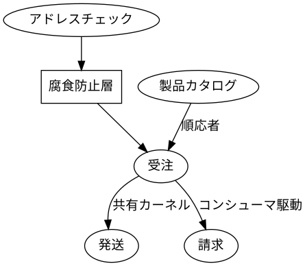
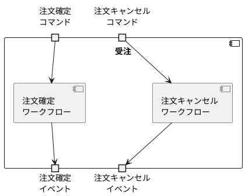
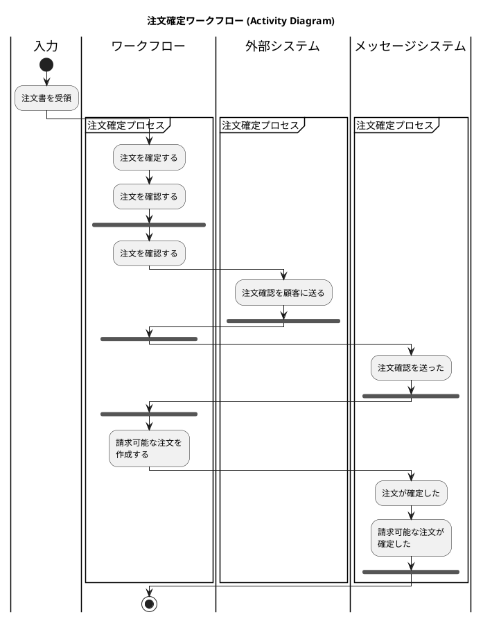

# 関数型ドメイン駆動モデリングの読書メモ

# 1章 ドメイン駆動設計の紹介

### 1.2.2 ドメインを探索する: 受注システム



# 2章 ドメインのモデリング

### 2.1.3 インプットとアウトプットを考える



## 2.4 ドメインの文書化

下記のイベントストーミングの結果がある。

```yaml
context: 
  name: 受注
workflows:
  - name: 注文を確定する
    input: 
      - name: 注文書
      - name: 製品カタログ
    command: 注文を確定する
    domain events: 
      - name: 注文を確定した
        policy: 
          - description: 注文確定時には注文確認書を送る
            command: 注文確認書を送る

  - name: 注文確認書を送る
    input: 
      - name: 注文書
    command: 注文確認書を送る
```



## 2.6 複雑さをドメインモデルで表現する

### 2.6.1 制約条件の表現

```plantuml
interface ProductCode <<sealed>> {
  + code(): String
}
note right of ProductCode: permits WidgetCode, GizmoCode

class WidgetCode <<record>> <<final>> {
  + code: String
}
note right of WidgetCode::code 
  Wで始まる4桁の数字
end note

class GizmoCode <<record>> <<final>> {
  + code: String
 }
 note right of GizmoCode::code 
   Gで始まる3桁の数字
end note
 
ProductCode <|-- WidgetCode
ProductCode <|-- GizmoCode
```

```plantuml
interface OrderQuantity <<sealed>> {
  + quantity(): Number
}
note right of OrderQuantity: permits UnitQuantity, KilogramQuantity

class UnitQuantity <<record>> <<final>> {
  + quantity: Integer
}
note right of UnitQuantity::quantity
  1 から 1000 まで
end note

class KilogramQuantity <<record>> <<final>> {
  + quantity: BigDecimal
}
note right of KilogramQuantity::quantity
  0.05 から 100.00 まで
end note

OrderQuantity <|-- UnitQuantity
OrderQuantity <|-- KilogramQuantity
```

### 2.6.2 注文のライフサイクルを表現する

```plantuml
class UnvalidatedOrder <<record>>  <<final>> {
  + customer: UnvalidatedCustomer
  + sippingAddress: UnvalidatedSippingAddress
  + billingAddress: UnvalidatedBillingAddress
  + orderItems: List<UnvalidatedOrderLine>
}

class UnvalidatedOrderLine {
  + productCode: ProductCode
  + quantity: OrderQuantity
}

class ValidatedOrder <<record>> <<final>> {
  + customer: ValidatedCustomer
  + sippingAddress: ValidatedSippingAddress
  + billingAddress: ValidatedBillingAddress
  + orderItems: List<ValidatedOrderLine>
}

class ValidatedOrderLine {
  + productCode: ProductCode
  + quantity: OrderQuantity
}

class PricedOrder <<record>> <<final>> {
  + customer: ValidatedCustomer
  + sippingAddress: ValidatedSippingAddress
  + billingAddress: ValidatedBillingAddress
  + orderItems: List<PricedOrderLine>
  + amountToBill: Money
}

class PricedOrderLine <<record>> <<final>> {
  + orderLine: ValidatedOrderLine
  + linePrice: Money
}

class PlacedOrderAcknowledgement {
  + pricedOrder: PricedOrder
  + acknowledgementLetter: AcknowledgementLetter
}
```

### 2.6.3 ワークフローのステップを具体化する

```yaml
workflows:
  - name: 注文を確定する
    input: 
      - name: 注文書
    output:
      oneOf: 
        - domainEvent: 
          - name: 注文を確定した
        - InvalidOrder:
    substeps:
      - ValidateOrder
      - PriceOrder
      - SendAcknowledgementToCustomer
      - SendPlacedOrderAcknowledgement
    return:
      - OrderPlacedEvent
```

```yaml
substeps:
  - name: ValidateOrder
    input: 
      - UnvalidatedOrder
    output:
      oneOf: 
        - ValidatedOrder
        - ValidationError
    dependencies:
      - CheckProductCodeExists
      - CheckAddressExists
    do:
      - "validate the customer name"
      - "check that the sipping and billing addresses exist"
      - for each line:
        - "check product code syntax"
        - "check that product code exists in ProductCatalog"
      - if everything is ok:
        - "return ValidatedOrder"
      - if there is an error:
        - "return ValidationError"

  - name: PriceOrder
    input: 
      - ValidatedOrder
    output:
      - PricedOrder
    dependencies:
        - GetProductPrice
    do:
      - for each line:
        - "get the price of the product"
        - "set the price for the line
      - "set the amount to bill (= sum of line prices)" 

  - name: SendAcknowledgementToCustomer
    input:
      - PricedOrder
    output: []
    do:
      - "create an acknowledgement letter"
      - "send the acknowledgement letter and the priced order to the customer"
```

# 3章 関数型アーキテクチャ

## 3.2 境界づけられたコンテストのコミュニケーション



## 3.3 境界づけられたコンテキスト間の契約



## 3.4 境界づけられたコンテキストでのワークフロー



### 3.4.2 境界づけられたコンテキスト内ではドメインイベントを避ける



# 4章 型の理解

## 4.3 型の合成

### 4.3.1 "AND"型

```fsharp
type FruitSalad = {
  Apple: AppleVriety
  Banana: BananaVriety
  Cherries: CherriesVriety
}
```

```java
record FruitSalad(AppleVriety apple, 
                  BananaVriety banana,
                  CherriesVriety cherries
) {}
```

### 4.3.2 "OR"型

```fsharp
type FruitSnack = 
  | Apple of AppleVriety
  | Banana of BananaVriety
  | Cherries of CherriesVriety
  
type AppleVariety =
  | GoldenDelicious
  | GrannySmith
  | Fuji

type BananaVariety =
  | Cavendish
  | GrosMichel
  | Manzano

type CherryVariety =
  | Montmorency
  | Bing
```

```java
public enum AppleVariety {
    GoldenDelicious, GrannySmith, Fuji
}

public enum BananaVariety {
    Cavendish, GrosMichel, Manzano
}

public enum CherryVariety {
    Montmorency, Bing
}

public sealed interface FruitSnack permits FruitSnack.Apple, FruitSnack.Banana, FruitSnack.Cherries {

    record Apple(AppleVariety variety) implements FruitSnack {}
    record Banana(BananaVariety variety) implements FruitSnack {}
    record Cherries(CherryVariety variety) implements FruitSnack {}
}
```

### 4.3.3 単純型

```fsharp
type ProductCode =
  | ProductCode of string
```

```java
record ProductCode(String code) {}
```

## 4.4 型を扱う

```java
record Person(String first, String last) {}

public sealed interface OrderQuantity permits OrderQuantity.UnitQuantity, OrderQuantity.KilogramQuantity {
    record UnitQuantity(int quantity) implements OrderQuantity {}
    record KilogramQuantity(BigDecimal quantity) implements OrderQuantity {}
}
```

## 4.5 型の合成によるドメインモデルの構築

```java
record CheckNumber(int checkNumber) {}
record CardNumber(String cardNumber) {}
```

```java
public sealed interface CardType permits CardType.Visa, CardType.MasterCard {
    record Visa(CardNumber cardNumber) implements CardType {}
    record MasterCard(CardNumber cardNumber) implements CardType {}
}
```

```java
import java.math.BigDecimal;

public sealed interface PaymentMethod permits PaymentMethod.Cash, PaymentMethod.CreditCardInfo, PaymentMethod.CheckNumber {
    record Cash(int amount) implements PaymentMethod {
    }

    record CreditCardInfo(CardType cardType) implements PaymentMethod {
    }

    record CheckNumber(int checkNumber) implements PaymentMethod {
    }
}

record PaymentAmount(BigDecimal paymentAmount) {}

public enum Currency {
    USD,
    EUR
}

record Payment(
        PaymentAmount amount,
        Currency currency,
        PaymentMethod method
) {}
```

```java
  @FunctionalInterface
  public interface PayInvoice {
      PaidInvoice apply(UnpaidInvoice invoice, Payment payment);
  }

  // 使用
  PayInvoice payInvoice = (invoice, payment) -> new PaidInvoice(invoice.invoiceNumber);
  PaidInvoice result = payInvoice.apply(unpaidInvoice, payment);
```

## 4.6

### 4.6.1

```java
record PersonalName(String firstName, Optional<String> middleInitial, String lastName) {}
```

### 4.6.2

```java
  Either<String, Integer> success = Either.right(42);
  Either<String, Integer> failure = Either.left("something went wrong");

 //パターンマッチング相当の操作:

  // F#: match result with | Ok v -> ... | Error e -> ...
  Either<String, Integer> result = Either.right(42);

  // ① fold — 両ケースを処理して値を返す
  String message = result.fold(
      error   -> "Error: " + error,   // Left (失敗)
      success -> "OK: " + success     // Right (成功)
  );
```

```java
  @FunctionalInterface
  public interface PayInvoice {
      Ether<PaidInvoice, PaymentError> apply(UnpaidInvoice invoice, Payment payment);
  }
```

```java
public enum PaymentError {
    CARD_TYPE_NOT_RECOGNIZED,
    PAYMENT_REJECTED,
    PAYMENT_PROVIDERS_OFFLINE
}
```

# 5章 型によるドメインモデリング

## 5.2 ドメインモデルのパターンを見る

* 単純な値
* ANDによる組み合わせ
* ORによる選択肢
* ワークフロー

#### Javaでのパターン

* 単純な値: recordで表現(ValueObject)
* ANDによる組み合わせ: recordで表現(Entity, AggregateRoot)
* ORによる選択肢: sealed interfaceで表現(ValueObject, Entity, AggregateRoot)
* ワークフロー: Functional Interfaceで表現

## 5.3 単純な値のモデリング

```java
record CustomerId(int customerId) {}
```

## 5.4 複雑なデータのモデリング

### 5.4.1 レコード型によるモデリング

Javaの場合、タイトルの通りになる。

```java
record Order(
  CustomerInfo customerInfo,
  ShippingAddress shippingAddress,
  BillingAddress billingAddress,
  List<OrderLine> orderLines,
  Money amountToBill
) {}
```

### 5.4.3 選択型によるモデリング

```java
public sealed interface OrderQuantity permits 
        OrderQuantity.UnitQuantity, OrderQuantity.KilogramQuantity {
    record UnitQuantity(int quantity) implements OrderQuantity {}
    record KilogramQuantity(BigDecimal quantity) implements OrderQuantity {}
}
```

## 5.5 関数によるワークフローのモデリング

### 5.5.1 複雑な入力と出力の処理

出力が複数ある場合はrecordで格納する

```java
record PlaceOrderEvents(
    AcknowlegementSent acknowlegementSent,
    OrderPlaced orderPlaced,
    BillableOrderPlaced billableOrderPlaced
) {}
```

ワークフローの型定義

```java
@FunctionalInterface
public interface PlaceOrder extends Function<UnvalidatedOrder, PlaceOrderEvents> {
}
```

どちらかを出力する場合

```java
public EnvelopeContents(String envelopeContents) {}
public sealed interface CategorizedMail 
        permits CategorizedMail.QuoteForm, CategorizedMail.OrderForm {
    record QuoteForm(String quoteForm) implements CategorizedMail {}
    record OrderForm(String orderForm) implements CategorizedMail {}
}

@FunctionalInterface
public interface CategorizeInboundMail extends Function<EnvelopeContents, CategorizedMail> {
}
```

複数の入力が必要な場合

```java
import java.util.PrimitiveIterator;

@FunctionalInterface
public interface CalculatePrices extends BiFunction<OrderForm, ProductCatalog, PricedOrder> {
}
```

### 5.5.2 関数シグネチャでエフェクトを文書化する

```java
@FunctionalInterface
public interface ValidateOrder extends Function<UnvalidatedOrder, Either<ValidationError, ValidatedOrder>> {
}

record ValidationError(String fieldName, String errorDescription) {}
```

非同期の場合

```java
import java.util.concurrent.CompletableFuture;

@FunctionalInterface
public interface ValidateOrderAsync
        extends Function<UnvalidatedOrder, CompletableFuture<Either<ValidationError, ValidatedOrder>>> {
}
```

## 5.6 アイデンティティの考察: 値オブジェクト

recordの`equals()`で判定する

```java
  var widgetCode1 = new WidgetCode("W12345");
  var widgetCode2 = new WidgetCode("W12345");
  
  IO.println(widgetCode1.equals(widgetCode2));
```

## 5.7 アイデンティティの考察: エンティティ

```java
public sealed interface Invoice permits Invoice.UnpaidInvoice, Invoice.PaidInvoice {
    InvoiceId invoiceId();
    record UnpaidInvoice(InvoiceId invoiceId) implements Invoice {}
    record PaidInvoice(InvoiceId invoiceId) implements Invoice {}
}
```

```java
   void someMethod() {
      var invoice = new Invoice.UnpaidInvoice(new InvoiceId(123));
      // ...
    
      switch (invoice) {
          case Invoice.UnpaidInvoice unpaidInvoice:
              System.out.println("The unpaid invoicdId is " + unpaidInvoice.invoiceId());
              // ...
          break;
          case Invoice.PaidInvoice paidInvoice:
              System.out.println("The paid invoiceId is " + paidInvoice.invoiceId());
              // ...
          break;
      }
   }
```


## 5.8 集約

```java
@FunctionalInterface
public interface ChangeOrderLinePrice {
    PricedOrder apply(OrderLine orderLine, OrderLineId orderLineId, Money newPrice);
}
```

```java
@Bean
public ChangeOrderLinePrice changeOrderLinePrice() {
    return (orderLine, orderLineId, newPrice) -> {
        var orderLines = order.orderLines().stream()
                .map(ol -> ol.orderLineId().equals(orderLineId) ? orderLine.withPrice(newPrice) : ol)
                .collect(Collectors.toList());
        return order.withOrderLines(orderLines);
    };
}
```

# 6章 ドメインの完全性と整合性

## 6.1 単純な値の完全性

```java
import io.vavr.control.Either;
import lombok.Builder;

@With
@Builder
public record UnitQuantity(int qty) {
    public UnitQuantity {
        if (qty < 1) {
            throw new IllegalArgumentException("UnitQuantity can not be negative");
        }
        if (qty > 1000) {
            throw new IllegalArgumentException("UnitQuantity can not be more than 1000");
        }
    }
    
    public static class UnitQuantityBuilder {
        
        public Either<String, UnitQuantity> safeBuild() {
            try {
                return Either.right(build());
            } catch (IllegalArgumentException e) {
                return Either.left(e.getMessage());
            }
        }
        
        private UnitQuantity build() {
            return new UnitQuantity(qty);
        }
    }
}
```

```java
private void someMethod() {
    var unitQuantity = UnitQuantity.builder().qty(100).safeBuild();
    unitQtyResult.fold(
            msg -> {
                System.out.printf("Failure, Message is %s%n", msg);
                return null;
            },
            uQty -> {
                System.out.printf("Success. Value is %s%n", uQty);
                int innerValue = uQty.qty();
                System.out.printf("innerValue is %d%n", innerValue);
                return null;
            }
    );
}
```

## 6.2 測定単位

```xml
  <dependency>
      <groupId>tech.units</groupId>
      <artifactId>indriya</artifactId>
      <version>2.2</version>
  </dependency>
```

```java
public class IndriyaDemo {

    public static void main(String[] args) {
        // 基本的な単位の生成
        Quantity<Length> distance = Quantities.getQuantity(100, Units.METRE);
        System.out.println("distance: " + distance);

        // 単位変換
        Quantity<Length> inKm = distance.to(MetricPrefix.KILO(Units.METRE));
        System.out.println("in km: " + inKm);

        Quantity<Length> inMm = distance.to(MetricPrefix.MILLI(Units.METRE));
        System.out.println("in mm: " + inMm);

        // 演算
        Quantity<Mass> m1 = Quantities.getQuantity(5.0, Units.KILOGRAM);
        Quantity<Mass> m2 = Quantities.getQuantity(3.0, Units.KILOGRAM);
        Quantity<Mass> total = m1.add(m2);
        System.out.println("total mass: " + total);

        // 速度 = 距離 / 時間
        Quantity<Length> d = Quantities.getQuantity(100, Units.METRE);
        Quantity<Time> t = Quantities.getQuantity(10, Units.SECOND);
        Quantity<?> speed = d.divide(t);
        System.out.println("speed: " + speed);

        // km/h への変換
        Quantity<Speed> speedKmh = Quantities.getQuantity(3.6, Units.KILOMETRE_PER_HOUR);
        System.out.println("speed in km/h: " + speedKmh);

        // 異なる単位同士の加算（自動変換される）
        Quantity<Length> km3 = Quantities.getQuantity(3, MetricPrefix.KILO(Units.METRE));
        Quantity<Length> m500 = Quantities.getQuantity(500, Units.METRE);
        Quantity<Length> sum = km3.add(m500);
        System.out.println("3 km + 500 m = " + sum);
        System.out.println("in km: " + sum.to(MetricPrefix.KILO(Units.METRE)));
        System.out.println("in m:  " + sum.to(Units.METRE));

        // 型安全: 以下はコンパイルエラーになる
        // Quantity<Length> invalid = m1.add(d); // Mass + Length は不可
    }
}
```

## 6.3 型システムによる不変条件の強制

```java
import io.vavr.collection.List;
import io.vavr.control.Either;

public record NonEmptyList<T>(T head, List<T> tail) {

    public NonEmptyList {
        if (head == null) {
            throw new IllegalArgumentException("head must not be null");
        }
    }

    public static <T> Either<String, NonEmptyList<T>> create(List<T> list) {
        if (list.isEmpty()) {
            return Either.left("list must not be empty");
        }
        return Either.right(new NonEmptyList<>(list.head(), list.tail()));
    }

    public static <T> NonEmptyList<T> of(T head, @SuppressWarnings("unchecked") T... rest) {
        return new NonEmptyList<>(head, List.of(rest));
    }

    public List<T> toList() {
        return tail.prepend(head);
    }

    public int size() {
        return 1 + tail.size();
    }
}

void someMethod() {
    // 使用例
    var nel = NonEmptyList.of("Alice", "Bob", "Charlie");
    System.out.println(nel.head());     // Alice
    System.out.println(nel.toList());   // List(Alice, Bob, Charlie)
    System.out.println(nel.size());     // 3
    
    // スマートコンストラクタ
    Either<String, NonEmptyList<String>> ok = NonEmptyList.create(List.of("A", "B"));
    System.out.println(ok); // Right(NonEmptyList[head=A, tail=List(B)])
    
    Either<String, NonEmptyList<String>> ng = NonEmptyList.create(List.empty());
    System.out.println(ng); // Left(list must not be empty)
}
```

## 6.4 ビジネスルールを型システムで表現する

```java
record EmailAddress(String email) {}

public sealed interface CustomerEmail permits CustomerEmail.Verified, CustomerEmail.Unverified {
    record Verified(EmailAddress emailAddress) implements CustomerEmail {}
    record Unverified(EmailAddress emailAddress) implements CustomerEmail {}
}
```

```java
public sealed interface ContactInfo permits ContactInfo.BothContractMethods, ContactInfo.PostalOnly, ContactInfo.EmailOnly {
    record EmailContactInfo(String emailAddress) {
    }

    record PostalContactInfo(String address) {
    }

    record BothContractMethods(EmailContactInfo email, PostalContactInfo postal) {
    }
}

public record Contract(
        Name name,
        ContactInfo contactInfo
) {}
```

## 6.5 整合性

なし。

## 6.6 まとめ

なし。

# 7章 パイプラインによるワークフローのモデリング

```yaml
- workflows:
    - name: "Place Order"
      input: UnvalidatedOrder
      output: 
        oneOf:
          - [OrderAcknowledgementSent, OrderPlaced, BillableOrderPlaced]
          - ValidationError
      steps:
        - do ValidateOrder
        - when:
            - "Order is invalid"
          then:
            - return: ValidationError
              
        - do PlaceOrder
        - do AcknowledgeOrder
        - create and return the events
```

## 7.1 ワークフローの入力

```java
/**
 * 未確認の注文
 * @param orderId
 * @param customerInfo
 * @param shippingAddress
 */
public record UnvalidatedOrder(
        String orderId,
        CustomerInfo customerInfo,
        ShippingAddress shippingAddress
        // ...
) {}
```

### 7.1.1 入力としてのコマンド

```java
public record PlaceOrder(
        UnvalidatedOrder orderForm,
        Instant timestamp,
        UserId userId
        // ...
) {}
```

### 7.1.2 ジェネリクスによる共通構造の共有

```java
public class Command<T>(
        T data,
        Instant timestamp,
        UserId userId
        // ...
){}
```

### 7.1.3 複数のコマンドを1つの型にまとめる

メッセージ・チャネルから受け取る場合に有用

```java
package com.example.eshop.shell.adapter.in.command;

public sealed interface OrderTakingCommand 
        permits OrderTakingCommand.Place, OrderTakingCommand.Change, OrderTakingCommand.Cancel {
    final class Place extends Command<UnvalidatedOrder> implements OrderTakingCommand {}
    final class Change extends Command<UnvalidatedChangeOrder> implements OrderTakingCommand {}
    final class Cancel extends Command<UnvalicatedCancelOrder> implements OrderTakingCommand {}
}
```

## 7.2 状態の集合による注文のモデリング

```plantuml
left to right direction

[*] --> 未処理の注文書
未処理の注文書 --> 未検証の注文
未処理の注文書 --> 未検証の見積り
未検証の注文 --> 検証済みの注文
検証済みの注文 --> 価格計算済みの注文
検証済みの注文 --> 無効な注文
```

```java
public record UnvalidatedOrder() {}
public record ValidatedOrder() {}
public record PricedOrder() {}

public sealed interface Order 
        permits Order.UnvalidatedOrder, Order.ValidatedOrder, Order.PricedOrder {
    record UnvalidatedOrder() implements Order {}
    record ValidatedOrder() implements Order {}
    record PricedOrder() implements Order {}
}
```

## 7.3 ステートマシン

### 7.3.2

```java
public class Item {
    String sku;
}

public class ActiveCartData {
    List<Item> unpaidItems;
}
public class PaidCartData {
    List<Item> paidItems;
    float paymentAmount; 
}

public sealed interface ShoppingCart 
        permits ShoppinCart.EmptyCart, ShoppingCart.ActiveCart, ShoppingCart.PaidCart {
    final class EmptyCart {
    }

    final class ActiveCart extends ActiveCartData implements ShoppingCart {
    }

    final class PaidCart extends PaidCartData implements ShoppingCart {
    }
}
```

```java
import org.springframework.context.annotation.Bean;

import java.util.function.BiFunction;

@Configuration
public class CartConfig {
    @Bean
    public BiFunction<ShoppingCart, Item, ShoppingCart> addItem() {
        return (cart, item) ->
                switch (cart) {
                    case EmptyCart emptyCart -> new ActiveCart(List.of(item));
                    case ActiveCart activeCart -> new ActiveCart(activeCart.unpaidItems().append(item));
                    case PaidCart _ -> cart; // 無視
                };
    }

    @Bean
    public BiFunction<ShoppingCart, Float> makePayment() {
        return (cart, paymentAmount) ->
                switch (cart) {
                    case EmptyCart emptyCart -> emptyCart;
                    case ActiveCart activeCart -> new PaidCart(activeCart.unpaidItems(), paymentAmount);
                    case PaidCart _ -> cart; // 無視
                }
    }
}
```

## 7.4 型を使ったワークフローの各ステップのモデリング

### 7.4.1 検証のステップ

製品コードの存在チェック

```java
@FunctionalInterface
public interface CheckProductCodeExists {
    Boolean apply(ProductCode productCode);
}
```

住所の存在チェック

```java
public CheckedAddress(UnValidatedAddress address) {}

@FunctionalInterface
public interface CheckAddressExists {
    Either<AddressValidationError, CheckedAddress> apply(UnValidatedAddress address);
}
```

注文の検証

```java
@FunctionalInterface
public interface ValidateOrder {
    Either<ValidationError, ValidateOrder> apply(CheckPorductCodeExists checkProductCodeExists,
                                                 CheckAddressExists checkAddressExists,
                                                 UnvalidatedOrder orderForm);
}
```

### 7.4.2 価格設定のステップ

```java
@FunctionalInterface
public interface GetProductPrice {
    Price apply(ProductCode productCode);
}

@FunctionalInterface
public interface PriceOrder {
    PricedOrder apply(GetProductPrice getProductPrice, ValidatedOrder order);
}
```

### 7.4.3 注文確認のステップ

```java
public record HtmlString(String html) {}

public record OrderAcknowledgement(EmailAddress emailAddress, HtmlString html) {}

@FunctionalInterface
public interface CreateOrderAcknowledgementLetter {
    HtmlString apply(PricedOrder order);
}

```

```java
public enum SendResult {
    SENT,
    NOT_SENT
}

@FunctionalInterface
public interface SendOrderAcknowledgement {
    SendResult apply(OrderAcknowledgement orderAcknowledgement);
}
```

```java
public record OrderAcknowledgementSent(OrderId orderId, EmailAddress emailAddress) {}

@FunctionalInterface
public interface AcknowledgeOrder {
    Optional<OrderAcknowledgementSent> apply(CreateOrderAcknowledgementLetter createOrderAcknowledgementLetter,
                                             SendOrderAcknowledgement sendOrderAcknowledgement,
                                             PricedOrder order);
}
```

### 7.4.4 返すイベントを作る

```java
public sealed interface PlaceOrderEvent 
        permits OrderPlaced, BillableOrderPlaced, OrderAcknowledgementSent {

}

public record OrderPlaced(PricedOrder order) implements PlaceOrderEvent {}
public record BillableOrderPlaced(OrderId orderId, BillingAddress billingAddress, 
                                  AmoutToBill amountToBill) implements PlaceOrderEvent{}
public record OrderAcknowledgement(EmailAddress emailAddress, HtmlString html) implements PlaceOrderEvent {}

@FunctionalInterface
public interface CreateEvents {
    List<PlaceOrderEvent> apply(PricedOrder order);
}
```

## 7.5 エフェクトの文書化

### 7.5.1 検証ステップでのエフェクト

非同期の結果

```java
public class CompletableEther<L, R>  extends CompletableFuture<Either<L, R>> {
}
```

シグネチャの変更

```java
@FunctionalInterface
public interface ValidateOrder {
    ComparableEther<ValidationError, ValidateOrder> apply(CheckPorductCodeExists checkProductCodeExists,
                                                 CheckAddressExists checkAddressExists,
                                                 UnvalidatedOrder orderForm);
}
```

### 7.5.2 価格設定ステップでのエフェクト

```java
public record PricingError(String message) {}

@FunctionalInterface
public interface PriceOrder {
    Ether<PricingError, PricedOrder> apply(GetProductPrice getProductPrice, ValidatedOrder order);
}
```

### 7.5.3 確認ステップでのエフェクト

```java
@FunctionalInterface
public interface SendOrderAcknowledgement {
    CompletableFuture<SendResult> apply(OrderAcknowledgement orderAcknowledgement);
}

@FunctionalInterface
public interface AcknowledgeOrder {
    CompletableFuture<Optional<OrderAcknowledgementSent>> apply(CreateOrderAcknowledgementLetter createOrderAcknowledgementLetter,
                                             SendOrderAcknowledgement sendOrderAcknowledgement,
                                             PricedOrder order);
}
```

## 7.6 ステップからワークフローを合成する

依存関係を取り除いたインタフェースを書いて一覧にしてみる。

```java
@FunctionalInterface
public interface ValidateOrder {
    ComparableEther<ValidationError, ValidateOrder> apply(UnvalidatedOrder orderForm);
}

@FunctionalInterface
public interface PriceOrder {
    Ether<PricingError, PricedOrder> apply(ValidatedOrder order);
}

@FunctionalInterface
public interface AcknowledgeOrder {
    CompletableFuture<Optional<OrderAcknowledgementSent>> apply(PricedOrder order);
}
```

上記は単純には繋がらない。

## 7.7 依存関係は設計の一部ですか?

```java
@FunctionalInterface
public interface PlaceOrderWorkflow {
    CompletableFuture<Either<PlaceOrderError, List<PlaceOrderEvent>>> apply(PlaceOrderCommand command);
}
```

## 7.8 パイプラインの完成形

## 7.9 長時間稼働するワークフロー

## 7.10 まとめ

## 7.11 次にやること

# 8章 関数の理解

## 8.1 関数、関数、どこにでも

## 8.2 「もの」としての関数

### 8.2.1 Javaで関数を「もの」として扱う

```java
Function<Integer, Integer> plus3 = x -> x + 3;
Function<Integer, Integer> times2 = x -> x * 2;
Function<Integer, Integer> square = x -> x * x;
Function<Integer, Integer> addThree = plus3;

var listOfFunctions = List.of(plus3, times2, square);
```

### 8.2.2 入力としての関数

```java
Function<Function<Integer, Integer>, Integer> evalWith5ThenAdd2 = f -> f.apply(5) + 2;
```

### 8.2,3 出力としての関数

```java
Function<Integer, Function<Integer, Integer>> adderGenerator = numberToAdd -> (x -> numberToAdd + x);
var add1 = adderGenerator.apply(1);
add1.apply(2);
// $12 ==> 3
```

### 8.2.4 カリー化

### 8.2.5 部分適用

```java
BiFunction<String, String, Void> sayGreeting = (greeting, name) -> {IO.println(String.format("%s %s", greeting, name)); return null;};
Function<String, Void> sayHello = name -> sayGreeting.apply("Hello", name);
sayHello.apply("John");
// -> Hello John
```

## 8.3 全域関数

```java
Function<Integer, Optional<Integer>> twelveDivideBy = n -> switch (n) {
    case 6, 5 -> Optional.of(2);
    case 4 -> Optional.of(3);
    //
    case 0 -> Optional.empty();
    default -> Optional.of(12 / n);
};
```

## 8.4 関数合成

### 8.4.1 Javaにおける関数の合成

```java
Function<Integer, Integer> add1ThenSquare = add1.andThen(square);
add1ThenSquare.apply(5);
// $2 ==> 36
```

## 8.5 まとめ

# 9章 実装: パイプラインの合成

```java
package com.example.eshop.port.in.order;

@FunctionalInterface
public interface PlaceOrder {
    CompletableFuture<Either<PlaceOrderError, List<PlaceOrderEvent>>> apply(UnvalidatedOrder orderForm);
}
```

```java
package com.example.eshop.application.order;

@Configuration
public class Order {
    @Bean
    public PlaceOrder placeOrder() {
        return orderForm -> validateOrder
                .andThen(priceOrder)
                .andThen(acknowledgeOrder)
                .andThen(createEvents);
    }
}
```

## 9.1 単純型を扱う

```java
package com.example.eshop.domain.model.order;

public record OrderId(string value) {
    public OrderId(String value) {
        if (Strings.isNullOrEmpty(value) || value.isBlank()) {
            throw new IllegalArgumentException("value must not be null or empty");
        } else if (value.length() > 50) {
            throw new IllegalArgumentException("value must not be longer than 50 characters");
        } else {
            this.value = value;
        }
    }
}
```

## 9.2 関数の型から実装を導く

```java
package com.example.eshop.domain.service.order;

@FunctionalInterface
public interface ValidateOrder {
    ValidateOrder apply(CheckPorductCodeExists checkProductCodeExists,
                        CheckAddressExists checkAddressExists,
                         UnvalidatedOrder orderForm);
}
```

## 9.3 検証ステップの実装

F#での関数のtypeの宣言は `@FunctionalInterface` で良さそう。

```java
package com.example.eshop.domain.service.order; // orderではないかも

@FunctionalInterface
public interface CheckAddressExists { 
    CheckedAddress apply(UnValidatedAddress address);
}
```

```java
@FunctionalInterface
public interface ValidateOrder {
    ValidateOrder apply(CheckPorductCodeExists checkProductCodeExists,
                        CheckAddressExists checkAddressExists,
                        UnvalidatedOrder unvalidatedOrder);
}
```

```java
@Configuration
public class ValidateOrderConfig {
    @Bean
    public ValidateOrder validateOrder() {
        return (checkProductCodeExists, checkAddressExists, unvalidatedOrder) -> {
            var orderId = OrderId.of(orderForm.orderId());
            var customerInfo = toCustomerInfo(unvalidatedOrder.customerInfo());
            var shippingAddress = toShippingAddress(unvalidatedOrder.shippingAddress());
            // ...
            return new ValidatedOrder(orderId, customerInfo, sippingAddress /* , ...*/);
        };
    }
    
    private CustomerInfo toCustomerInfo(UnvalidatedCustomerInfo unvalidatedCustomerInfo) {
        var firstName = Stirng50.create(unvalidatedCustomerInfo.firstName());
        var lastName = Stirng50.create(unvalidatedCustomerInfo.lastName());
        var emailAddress = EmailAddress.create(unvalidatedCustomerInfo.emailAddress());
        var name = Name.create(firstName, lastName);
        return CustomerInfo.create(name, emailAddress);
    }
}
```

### 9.3.1 検証されたチェック済み住所の作成

```java
    private Address toAddress(CheckAddressExists checkAddressExists, 
                                            UnValidatedAddress unValidatedAddress) {
        var checkedAddress = checkAddressExists.apply(unValidatedAddress);
        var addressLine1 = String50.create(checkedAddress.addressLine1());
        var addressLine2 = String50.createOption(checkedAddress.addressLine2());
        var addressLine3 = String50.createOption(checkedAddress.addressLine3());
        var addressLine4 = String50.createOption(checkedAddress.addressLine4());
        var city = String50.create(checkedAddress.city());
        var zipCode = String50.create(checkedAddress.zipCode());
        var country = String50.create(checkedAddress.country());
        return new Address(addressLine1, addressLine2, addressLine3, addressLine4,
                city, zipCode);
    }
```

```java
    @Bean
    public ValidateOrder validateOrder() {
        return (checkProductCodeExists, checkAddressExists, unvalidatedOrder) -> {
            var orderId = OrderId.of(orderForm.orderId());
            var customerInfo = toCustomerInfo(unvalidatedOrder.customerInfo());
            var shippingAddress = toShippingAddress(checkAddressExists, unvalidatedOrder.shippingAddress());
            // ...
            return new ValidatedOrder(orderId, customerInfo, sippingAddress /* , ...*/);
        };
    }

```

### 9.3.2 明細行の作成

```java
private ValidatedOrderLine toValidatedOrderLine(CheckProductCodeExists checkProductCodeExists, 
                                                UnvalidatedOrderLine unvalidatedOrderLine) {
    var orderLineId = OrderLineId.of(unvalidatedOrderLine.orderLineId());
    var productCode = toProductCode(unvalidatedOrderLine.productCode());
    var quantity = toOrderQuantity(unvalidatedOrderLine.quantity());
    return new ValidatedOrderLine(orderLineId, productCode, quantity);
}
```

```java
private ValidateOrder validateOrder() {
    return (checkProductCodeExists, checkAddressExists, unvalidatedOrder) -> {
        // var orderId = ...
        // var customerInfo = ...
        // var shippingAddress = ...
        // ...
        var orderLines = unvalidatedOrder.orderLines()
                .map(orderLine -> toValidatedOrderLine(checkProductCodeExists, orderLine))
                .toList();
        // ...
        return new ValidatedOrder(orderId, customerInfo, sippingAddress /*, ... */);
    };
}
```

```java
import org.springframework.core.annotation.Order;

private OrderQuauntity toOrderQuantity(ProductCode productCode, Quantity quantity) {
    switch (productCode) {
        case Widget _ -> new UnitQuatity(quantity.value().toInt());
        case Gadget _ -> new KilogramQuantity(quantity.value().toInt());
    }
}
```

### 9.3.3 関数アダプターの作成

```java
static <T> UnaryOperator<T> predicateToPassthru(String errorMsg, Predicate<T> f) {
    return x -> {
        if (f.test(x)) return x;
        throw new RuntimeException(errorMsg);
    };
}

private ProductCode toProductCode(CheckPorductCodeExists checkProductCodeExists, ProductCode productCode) {
    Function<ProductCode, ProductCode> checkProduct = productCode -> {
        var errorMessage = String.format("Product code %s does not exist", productCode);
        predicateToPassthru(errorMessage, checkProductCodeExists).apply(productCode);
    };
    
    return checkProduct.apply(new ProductCode(productCode));
}
```