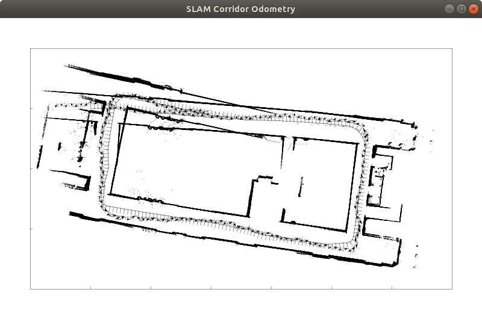
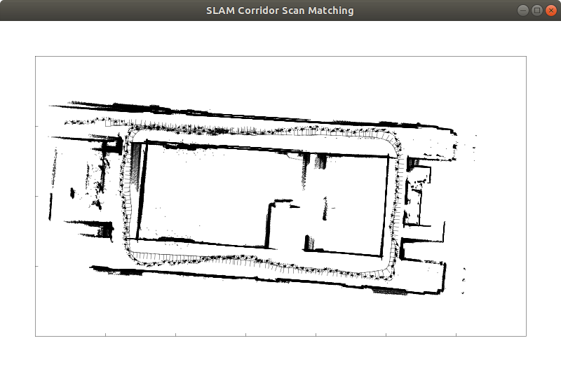
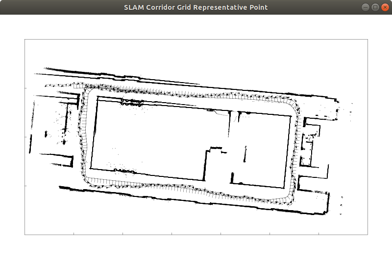
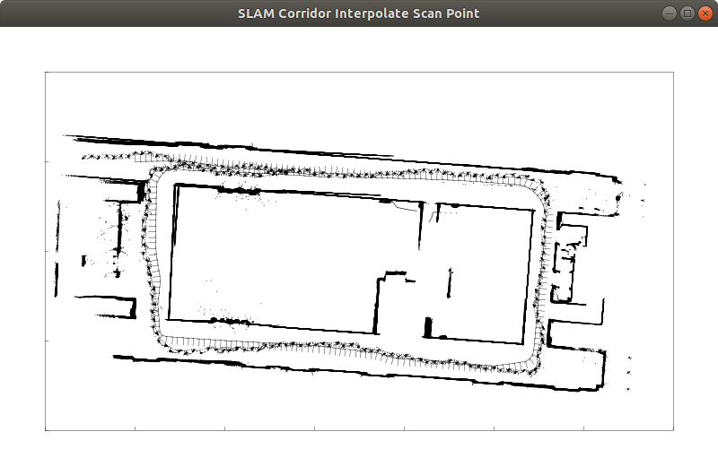
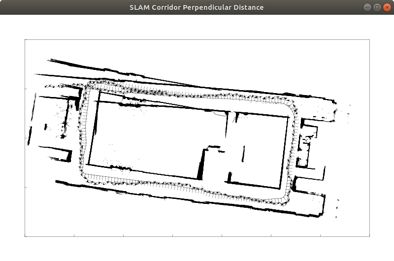
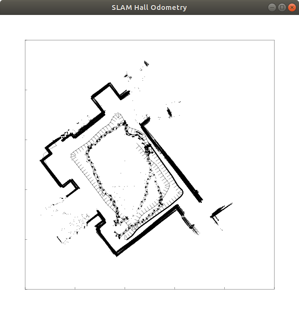
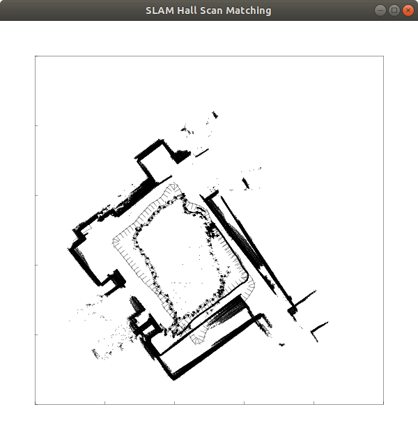
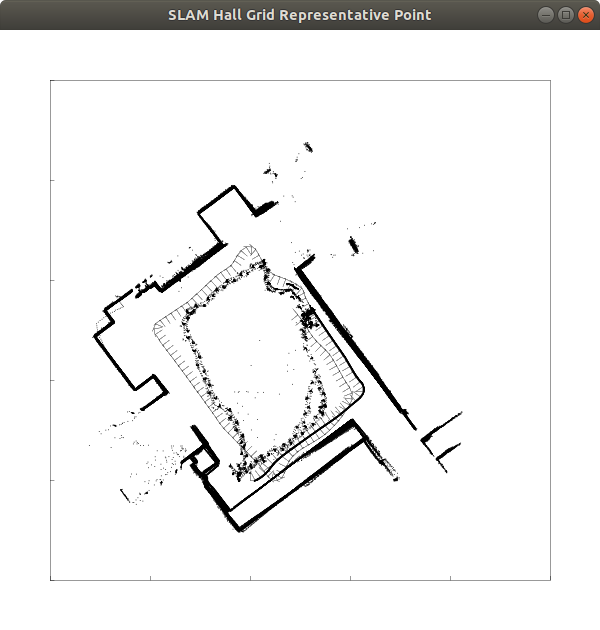
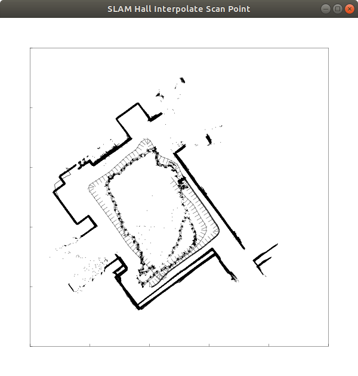

# SLAM

[SLAM入門: ロボットの自己位置推定と地図構築の技術](https://www.amazon.co.jp/dp/4274221660/)の内容をScalaで実装してみる。

## 廊下

オドメトリ

スキャン・マッチング

点群を格子に分割して代表点でマッチング

スキャンを等間隔にする

垂直距離をコスト関数にする

## ホール

オドメトリ

スキャン・マッチング

点群を格子に分割して代表点でマッチング

スキャンを等間隔にする

垂直距離をコスト関数にする

